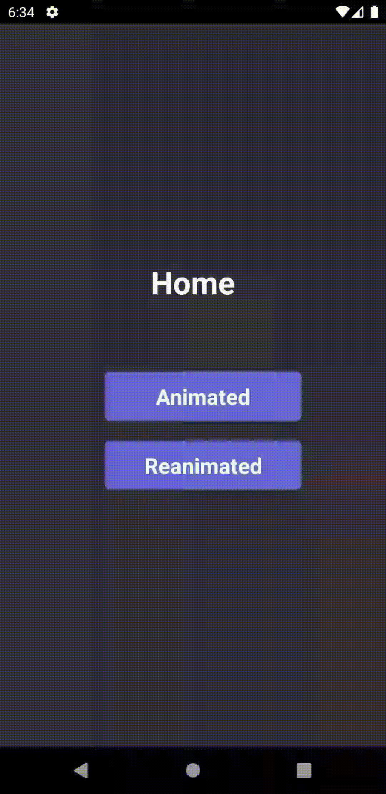

# React Native Animations

### Exemplos de animações no React Native.

## 👨‍💻 Tecnologias Utilizadas

Esse projeto foi construído utilizando as seguintes tecnologias:

### Mobile

  - [React Native](https://reactnative.dev/)
  
### Dependencies

  - [TypeScript](https://www.typescriptlang.org/)
  - [RN Animated API](https://reactnative.dev/docs/animated)
  - [React Native Reanimated](https://docs.swmansion.com/react-native-reanimated/)
  - [Lottie React Native](https://github.com/lottie-react-native/lottie-react-native)

## Screenshots 📸

  
  
  
  

